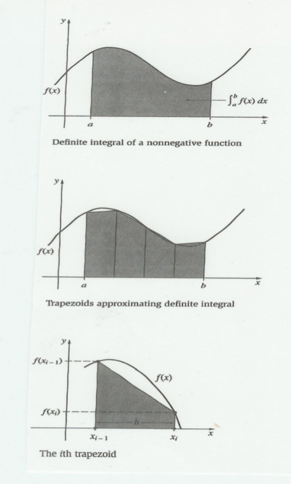

# integral - całka

## Problem:
Przybliżanie wartości całki metogą trapezów.



## Rozwiązanie:


###Algorytm sekwencyjny:

1. Wyliczamy `h`:
`h = (b – a) / n`, oraz ustalamy `x`:
`x = a;`
2. Dla `i = {0..n}` wyliczamy przybliżenie całki:

```
integral += [ f(x) + f(x+h) ] / 2 * h,
`x += h,
```

3. Wypisujemy wynik.


