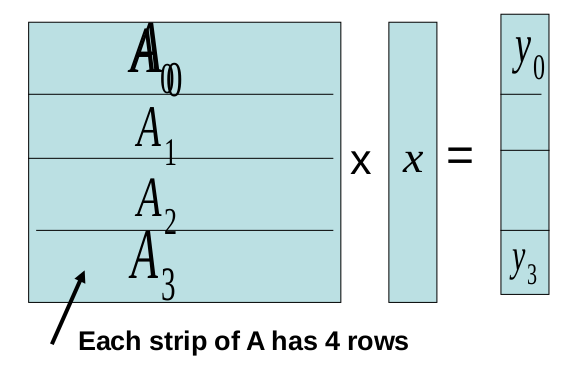
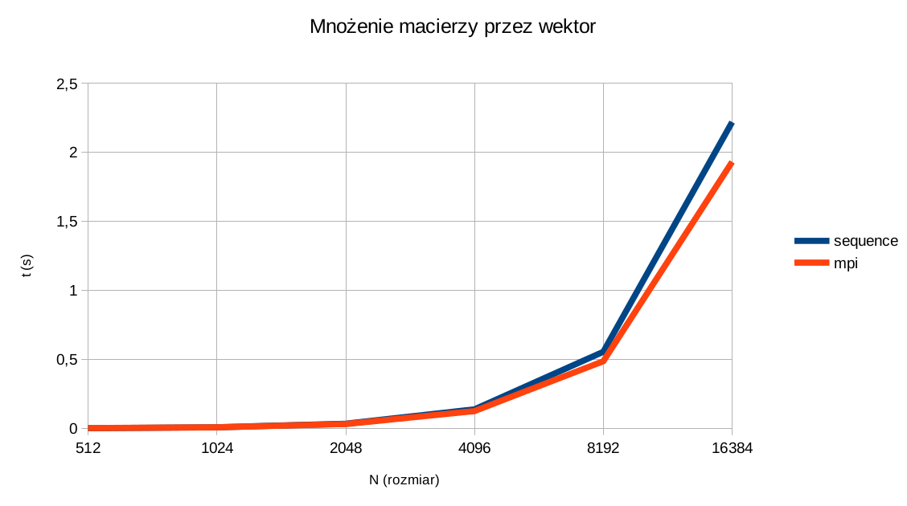

#matrix-vector - mnożenie macierzy przez wektora

## Problem

Wyliczanie iloczynu macierzy kwadratowej oraz wektora.



## Rozwiązanie

### Algorytm sekwencyjny

##### 1. Wypełniamy macierz `M[ size ][ size ]` oraz wektor `N[ size ]` losowymi liczbami,

##### 2. Wyliczamy iloczyn macierz/wektor `W[ size ]` stosując wzór:

```
W[ i ] = M[ i ] * N[ i ]; 
```
Gdzie `M[ i ]` oznacza i-ty rząd mcierzy `M`,

##### 3. Drukujemy wynik `W[ size ]`.

---

### Algorytm równoległy (MPI):

##### 0.1. Jeśli `n % np != 0` obliczamy resztę (brakujące elementy aby `n % np == 0`):

```
rest = (np - (n % np) % np;
```

A następnie obliczamy nowy rozmiar:

```
n_size = size + rest;
```

##### 0.2 Jeśli `n % np == 0` przyjmujemy, że: `n_size = size`,

##### 0.3. Macierz zapisujemy jako tablicę jednowymiarową `M[ n_size * n_size ]` oraz zamiast odwołań `M[ i ][ j ]` sotsujemy `M[ (i * n_size) + j ]`,

##### 1. proces o `rank` równym `0` wypełnia macierz `M[ n_size * n_size ]` i wektor `N[ n_size ]` losowymi liczbami,

##### 1.2 jeśli `n_size != size` to wypełniami zerami pola macierzy i wektora jeśli spełniają one warunek:

```
i >= size || j >= size,
```

##### 2. dokonujemy podziału macierzy i wektora pomiędzy procesy (`MPI_Scatter`), każdy proces otrzyma swoją część o rozmiarze:
```
M[ part * n_size ], N[ part ];
```

Gdzie `part = n_size / np`,

##### 3. każdy z procesów wylicza swoją część wyniku `W[ part ]` , stosując wzór:

```
W[ i ] = M[ i ] * N[ i ];
````

Gdzie `M[ i ]` oznacza `M[ i_start..i_stop ]`, gdzie:

```
i_start = i * n_size;
i_stop = (i+1) * n_size – 1;
```

##### 4. dokonujemy zebrania wyników od wszystkich procesów (`MPI_Gather`),
##### 5. proces o rank 0 wypisuje wynik `W[ n_size ]`.


## Testy

### Sprzęt

Do testów (pomiarów czasów) używałem notebooka Samsung R590 z
procesorem Intel Core-i3 (2 rdzenie, 4 wątki) oraz pamięcią RAM o rozmiarze
4GB (2x2GB).

### Przebieg

Testy polegały na 500-krotnym uruchomieniu każdej z wersji programu
(sekwencyjenj i równoległej) dla n = {512, 1024, 2048, 4096, 8192, 16384}.
Następie następowało zliczanie czasów działania każdego uruchomienia oraz
wyliczanie śrendnich czasów dla obu wersji dla każdego n.
Średnie czasy zostały użyte do opracowania wyników.

### Wyniki

Legenda:
* `n` – rozmiar macierzy oraz wektorów
* `sequence` – czas wersji sekwencyjnej (w sekundach)
* `mpi` – czas wersji równoległej (w sekundach)

```
n 			sequence 		mpi
512 		0,0021512926 	0,0029377719

1024 		0,0086381118 	0,0083335335

2048 		0,0346359677 	0,031675844

4096 		0,1386989741 	0,1254135152

8192 		0,5553865904 	0,4874168239

16384 		2,2208332317 	1,9318449937
```


