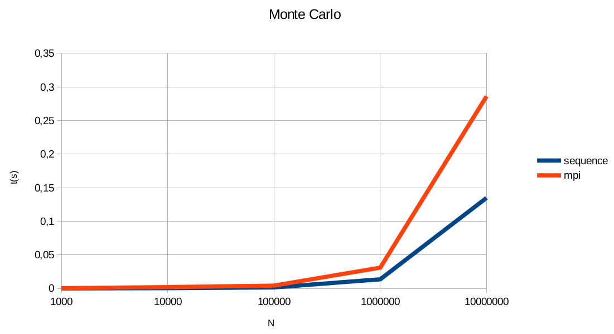

# monte-carlo - metoda Monte Carlo

## Problem:

Oszacować liczbę `π` metodą Monte Carlo.


## Rozwiązanie

### Algorytm sekwencyjny

##### 1. Wylosuj i zapisz `n `par liczb `(x,y)` z przedziału `<0,1>`,

##### 2. Dla każdej pary `(x,y)` sprawdź czy spełnia ona warunek `x^2 + y^2<=1`,

##### 2.1 jeśli tak to zwiększ `liczbę trafień` o `1`,

##### 3. Podziel `ilość trafień` przez `n`. Wypisz wynik.

---

### Algorytm równoległy (MPI)

##### 1. Proces z `rank` równym `0` losuje i zapisuje `n` par liczb `(x,y)` z przedziału `<0,1>`, a następnie rozsyła je do wszystkich procesów (`MPI_Bcast`),

##### 2. Każdy proces sprawdza pary czy `(x,y)` o numerach od `rank*n/np` do `(rank+1)*n/np - 1` spełniają warunek `x^2 + y^2<=1`,

##### 2.1 jeśli tak to zwiększa `liczbę trafień` o `1`,

##### 3. Procesy komunikują się z procesem o `rank` równym `0` i zliczają `ilość trafień` (`MPI_Reduce`)

##### 4. Proces o `rank` równym `0` dzieli `ilość trafień` przez `n` oraz wypisuje wynik.

## Testy

### Sprzęt

Do testów (pomiarów czasów) używałem notebooka Samsung R590 z
procesorem Intel Core-i3 (2 rdzenie, 4 wątki) oraz pamięcią RAM o rozmiarze
4GB (2x2GB).

### Przebieg

Testy polegały na 500-krotnym uruchomieniu każdej z wersji programu
(sekwencyjenj i równoległej) dla n = {1.000, 10.000, 100.000, 1.000.000,
10.000.000}. Następie następowało zliczanie czasów działania każdego
uruchomienia oraz wyliczanie śrendnich czasów dla obu wersji dla każdego n.
Średnie czasy zostały użyte do opracowania wyników.

### Wyniki

Legenda:
* `n` – ilość par (x,y)
* `sequence` – czas wersji sekwencyjnej (w sekundach)
* `mpi` – czas wersji równoległej (w sekundach)

````
n 			sequence 		mpi
1000 		0,000026786 	0,0002664562

10000 		0,0002202989 	0,0017413423

100000 		0,0013326338 	0,0040454856

1000000 	0,0134396426 	0,0307324222

10000000 	0,1346255327 	0,2859360808
```


