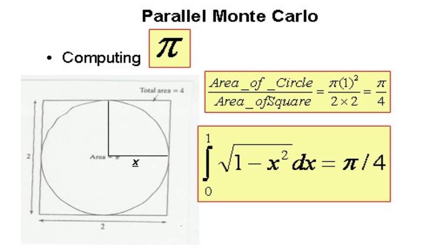

# monte-carlo - metoda Monte Carlo

## Problem:

Oszacować liczbę `π` metodą Monte Carlo.

## Rozwiązanie

### Algorytm sekwencyjny

##### 1. Wylosuj i zapisz `n `par liczb `(x,y)` z przedziału `<0,1>`,

##### 2. Dla każdej pary `(x,y)` sprawdź czy spełnia ona warunek `x^2 + y^2<=1`,

##### 2.1 jeśli tak to zwiększ `liczbę trafień` o `1`,

##### 3. Podziel `ilość trafień` przez `n`. Wypisz wynik.

### Algorytm równoległy (MPI)

##### 1. Proces z `rank` równym `0` losuje i zapisuje `n` par liczb `(x,y)` z przedziału `<0,1>`, a następnie rozsyła je do wszystkich procesów (`MPI_Bcast`),

##### 2. Każdy proces sprawdza pary czy `(x,y)` o numerach od `rank*n/np` do `(rank+1)*n/np - 1` spełniają warunek `x^2 + y^2<=1`,

##### 2.1 jeśli tak to zwiększa `liczbę trafień` o `1`,

##### 3. Procesy komunikują się z procesem o `rank` równym `0` i zliczają `ilość trafień` (`MPI_Reduce`)

##### 4. Proces o `rank` równym `0` dzieli `ilość trafień` przez `n` oraz wypisuje wynik.
